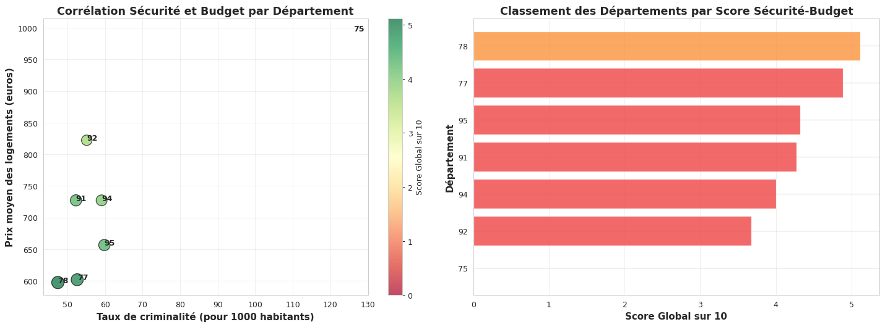
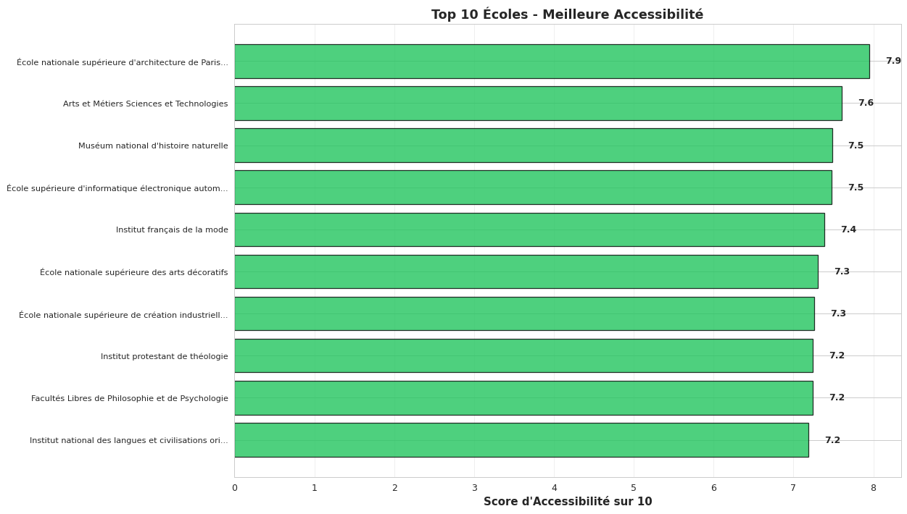
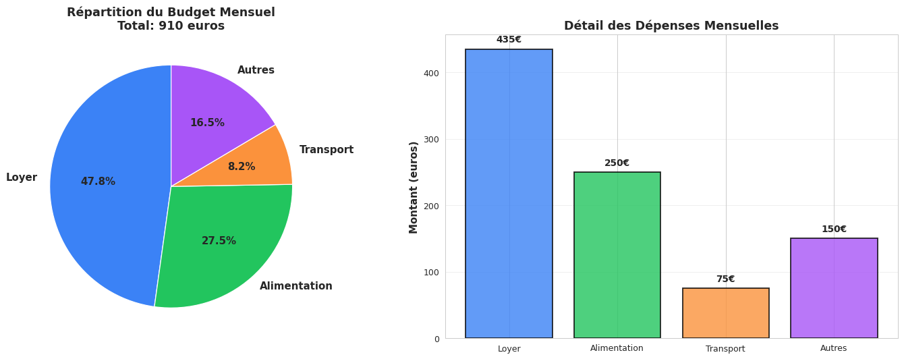

# Aide à la recherche de logement étudiant en Île-de-France

Projet de data visualisation en Python (notebook Jupyter). Le point de départ : un étudiant cherche un logement à Paris ou en Île-de-France, avec un budget limité, près de son école et dans un environnement agréable (transports, espaces verts, commerces).

Le notebook croise plusieurs jeux de données (écoles, résidences CROUS, logements privés, gares, espaces verts, commerces, criminalité) et propose dix outils interactifs (ipywidgets, Folium, Plotly) pour comparer les offres et aider à choisir.

## Les dix widgets

1. Carte autour d'une école : résidences CROUS, logements privés et gares les plus proches.
2. Espaces verts les plus proches d'un logement.
3. Répartition des écoles par secteur (public / privé) et par département.
4. Recommandation de logements autour d'une école, selon le budget, la surface minimale et la distance maximale.
5. Commerces par commune et par type (alimentaire ou classique).
6. Comparaison des loyers et des surfaces entre CROUS et logements privés.
7. Score par département combinant sécurité (taux de criminalité) et coût du logement.
8. Score d'accessibilité de chaque école (gares à moins de 1 km, logements à moins de 3 km, prix moyen).
9. Simulateur de budget mensuel (loyer, alimentation, transport, autres dépenses).
10. Carte de densité des services étudiants (heatmap).

## Quelques résultats

| Sécurité et coût par département | Accessibilité des écoles |
|---|---|
|  |  |



- Les Yvelines (78) et la Seine-et-Marne (77) obtiennent le meilleur compromis entre sécurité et loyer. Paris arrive dernier : c'est à la fois le département le plus cher (environ 995 € en moyenne dans nos données) et celui où le taux de criminalité est le plus élevé.
- Les écoles les mieux desservies sont dans Paris intra-muros, avec 7 à 12 gares à moins d'un kilomètre.

## Données

Les fichiers nettoyés sont dans `data/` :

| Fichier | Contenu |
|---|---|
| `etablissements_IDF_final.csv` | Écoles et universités (secteur, adresse, coordonnées) |
| `crous_idf_loyers_geo_complet.csv` | Résidences CROUS, types de logement, surfaces et loyers |
| `idf_lt50_appart_avec_prix_location.csv` | Appartements de moins de 50 m² avec un loyer estimé |
| `emplacement-des-gares-idf.csv` | Gares et stations (Île-de-France Mobilités) |
| `espaces_verts_idf.csv` | Parcs et espaces verts |
| `magasins_nourriture_long.csv`, `magasins_classiques_long.csv` | Nombre de commerces par commune et par type |
| `taux_criminalite_idf_par_departement_2024.csv` | Taux de criminalité pour 1 000 habitants en 2024 |

## Lancer le notebook

```bash
pip install -r requirements.txt
jupyter notebook analyse_logement_etudiant.ipynb
```

Les widgets ne s'affichent pas dans l'aperçu GitHub : il faut exécuter le notebook (Jupyter ou Google Colab).

## Limites

- Les distances sont calculées ligne par ligne avec `geodesic` sur plus de 40 000 logements, à chaque changement dans un widget. Un calcul vectorisé (formule de haversine avec numpy) serait beaucoup plus rapide.
- Le score sécurité / coût est normalisé entre départements. Paris obtient donc 0 parce qu'il est le pire sur les deux critères, ce qui ne veut pas dire qu'on ne peut pas y trouver de logement adapté.
- Les loyers du parc privé sont estimés à partir d'un prix de référence au m², ce ne sont pas des annonces réelles.
